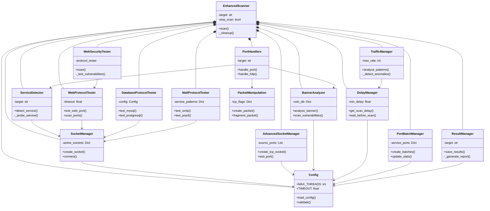

<p align="center">
  <strong><span style="font-size: 1000px;">OSG-SCAN</span></strong>
</p>

<p align="center">
وقتی OSG Scan هست، دیگه به Nmap فکر نکن.
</p>

<p align="center">
  
</p>

## نصب و بروزرسانی

```bash
bash <(curl -Ls https://raw.githubusercontent.com/mohamadm0meni/OSG-SCAN/main/install.sh)
```

### **پارامترهای اختیاری:**
| گزینه | توضیحات |
|--------|-------------|
| `-h, --help` | نمایش پیغام راهنما |
| `-p PORTS, --ports PORTS` | تعیین محدوده پورت (مثال: `1-1000`) |
| `-t THREADS, --threads THREADS` | تعداد thread های اسکن |
| `--timing {0,1,2,3,4,5}` | پروفایل زمان‌بندی (0=پارانوید، 5=فوق سریع) |
| `--profile {stealth,normal,aggressive}` | انتخاب پروفایل اسکن |
| `-o {text,json,xml,html}, --output {text,json,xml,html}` | فرمت خروجی |
| `--config CONFIG` | مسیر فایل پیکربندی |
| `--debug` | فعال‌سازی حالت اشکال‌زدایی |
| `--no-banner` | غیرفعال‌سازی دریافت banner |
| `--service-detection` | فعال‌سازی تشخیص سرویس |
| `--vuln-check` | فعال‌سازی ارزیابی آسیب‌پذیری |
| `--interface INTERFACE` | تعیین رابط شبکه برای اسکن |
| `--exclude-ports EXCLUDE_PORTS` | مستثنی کردن پورت‌های خاص (مثال: `80,443,3306`) |
| `--source-port SOURCE_PORT` | تعیین پورت مبدا |

## 📌 مثال‌ها

```yaml
# اسکن پایه
osgscan example.com

# اسکن پورت‌های 1 تا 1000
osgscan example.com -p 1-1000

# اسکن با پروفایل زمان‌بندی 3 و 20 thread
osgscan example.com -p 1-1000 --timing 3 --threads 20

# اسکن مخفیانه با خروجی JSON
osgscan example.com --profile stealth --output json
```

## 🚀 ویژگی‌ها

> **اسکنر پورت پیشرفته و مخفیانه**  

✅ **اسکن پورت سریع و پیشرفته**  
✅ **تشخیص سرویس** برای سرویس‌های فعال روی هدف  
✅ **ارزیابی آسیب‌پذیری** بر اساس پایگاه داده به‌روز  
✅ **دور زدن IDS و IPS** برای اسکن‌های مخفیانه  
✅ **سازگار با سیستم‌های مختلف**، تست شده روی **MikroTik** و **Snort**  
✅ **خروجی در فرمت‌های JSON، متن و پایگاه داده** با جزئیات کامل شامل:  
&nbsp;&nbsp;&nbsp;&nbsp;📌 **جزئیات زمان و میزبان**  
&nbsp;&nbsp;&nbsp;&nbsp;📌 **پورت‌های باز، بسته و فیلتر شده**  
&nbsp;&nbsp;&nbsp;&nbsp;📌 **شناسایی سرویس و تشخیص banner**  

---

# نمودار کلاس‌ها


